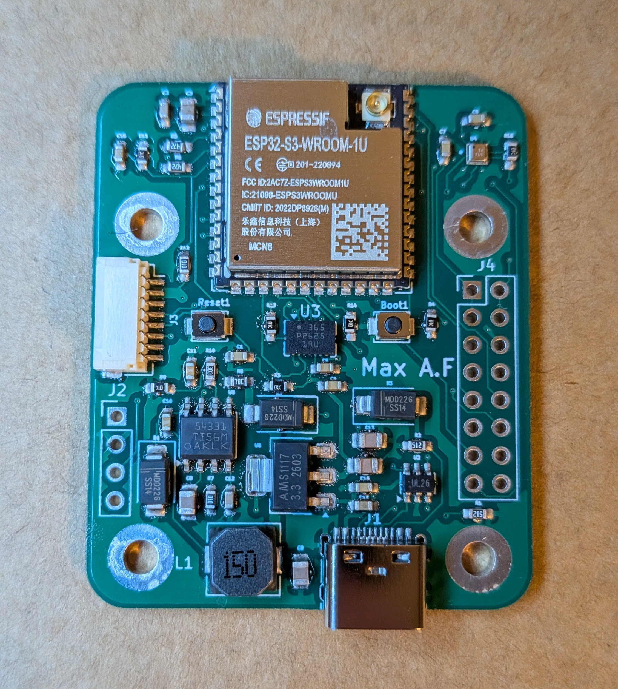
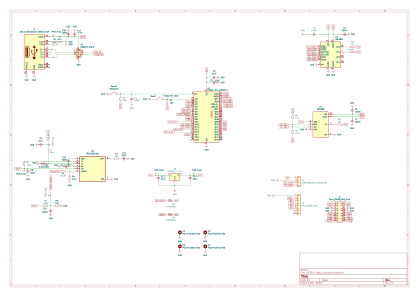

# ESP32-S3 Custom Flight Controller

A custom-designed drone flight controller built from the ground up around the ESP32-S3 microcontroller. This project is a work-in-progress, covering everything from custom PCB design in KiCad to low-level sensor drivers and Web Serial 3D visualization.

## Hardware Features
- **Microcontroller**: ESP32-S3
- **IMU**: Bosch BMI088 (6-axis accelerometer & gyroscope) via SPI
- **Barometer**: Bosch BMP388 via I2C
- **PCB**: Custom designed in KiCad, hand-soldered SMD components.

## Software / Firmware
The firmware is written in C++ (Arduino framework) and features:
- **Raw SPI Communication**: Bypasses bloated libraries to communicate directly with the BMI088 registers, resolving complex ESP32 HAL macro conflicts.
- **Sensor Fusion**: Implements a custom Complementary Filter combining high-speed gyro data with accelerometer gravity vectors for stable, drift-free Pitch and Roll calculation.
- **Barometric Altimeter**: Features an auto-zeroing routine on startup to establish local ground-level pressure before calculating relative altitude in meters.

## 3D Web Visualizer
Included in the `tools/` directory is a custom HTML5/Three.js 3D drone visualizer. 
It uses the modern **Web Serial API** to connect directly to the flight controller via USB (no servers required) and renders the drone's orientation in real-time at 60fps based on the live IMU telemetry.

## Directory Structure
- `hardware/`: KiCad schematics and PCB layout files.
- `firmware/FlightController/`: The main C++ Arduino sketch containing sensor drivers and mathematical filters.
- `tools/`: Contains `3D_Viewer.html` (Double-click to open in a modern browser).

## Roadmap / To-Do
- [x] PCB Design & Assembly
- [x] I2C & SPI Bring-up
- [x] Raw IMU & Barometer Data Extraction
- [x] Sensor Fusion (Complementary Filter)
- [x] Real-time 3D Visualization
- [ ] PID Controller Implementation
- [ ] ESC Motor Output (DSHOT/PWM)
- [ ] Radio Receiver Integration (ExpressLRS/Crossfire)

*Hardware designed from scratch by Max. Firmware and 3D visualization developed using AI-assisted pair programming.*

## Hardware design process

